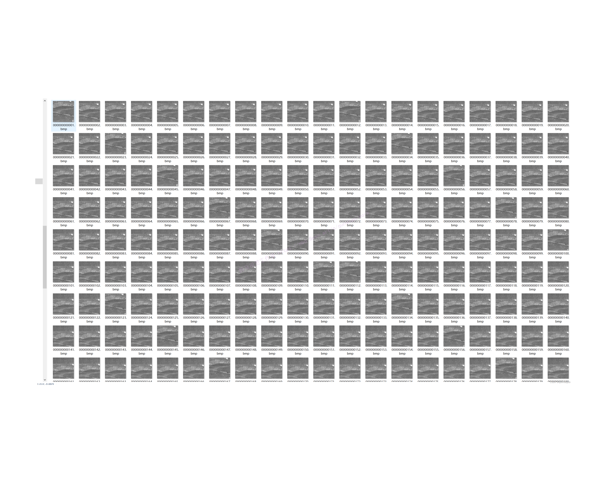
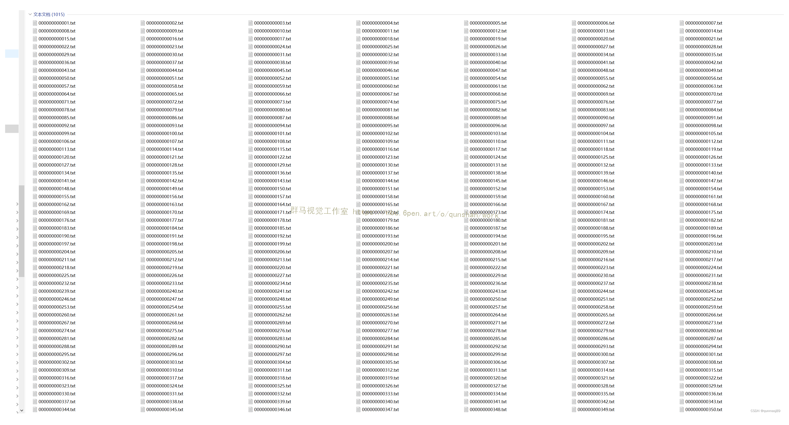
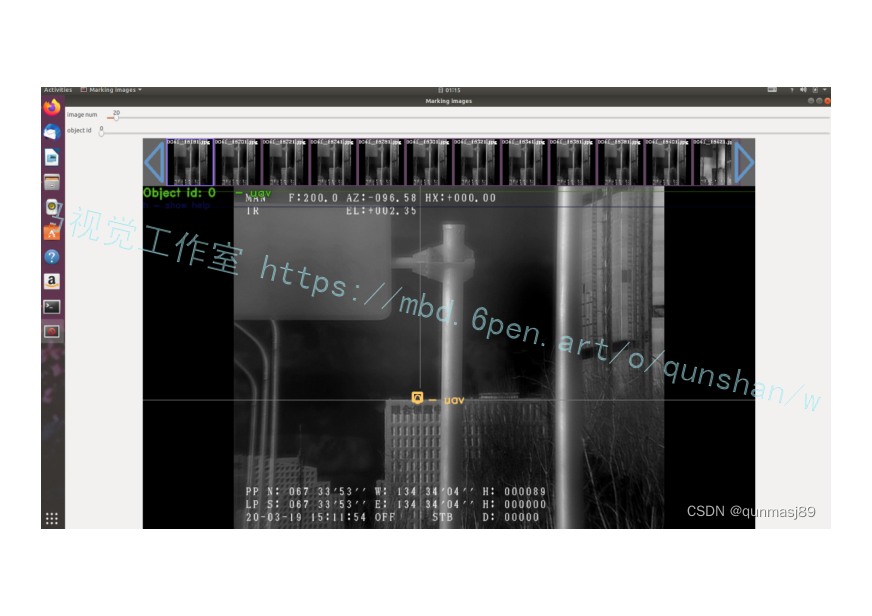
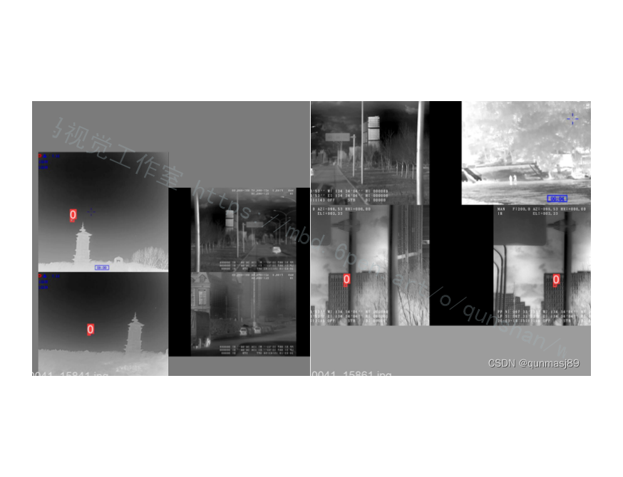
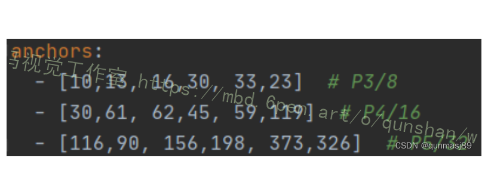
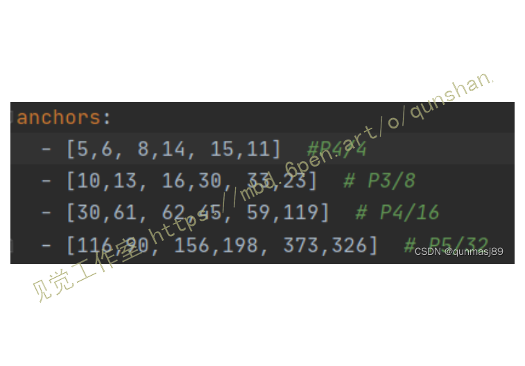
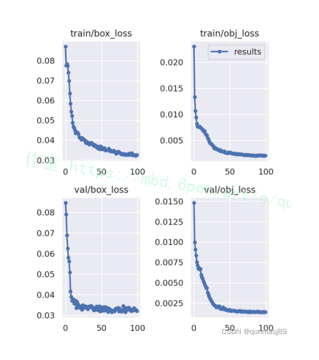
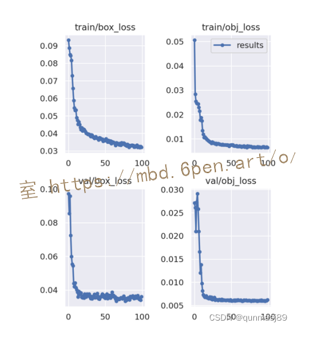

# 基于小目标检测头的改进YOLOv5红外遥感图像小目标检测系统

# 1.研究背景与意义


随着科技的不断发展，红外遥感技术在军事、安防、环境监测等领域中得到了广泛应用。红外遥感图像具有独特的优势，可以在夜间或恶劣天气条件下获取目标信息，因此在小目标检测方面具有重要的应用价值。然而，由于红外图像的低对比度、噪声干扰等问题，小目标检测仍然是一个具有挑战性的问题。

目前，深度学习已经在计算机视觉领域取得了显著的成果，特别是目标检测领域。YOLO（You Only Look Once）是一种基于深度学习的实时目标检测算法，其通过将目标检测问题转化为回归问题，将目标的位置和类别同时预测出来。YOLO算法具有快速、准确的特点，因此在目标检测领域受到了广泛关注。

然而，传统的YOLO算法在红外遥感图像中小目标检测方面存在一些问题。首先，红外图像中的小目标往往具有低对比度，导致目标的边缘信息不明显，难以准确检测。其次，红外图像中存在大量的噪声干扰，这些噪声会干扰目标的检测和识别。此外，红外图像中的小目标往往具有多尺度和多方向的特点，传统的YOLO算法难以处理这种复杂情况。

因此，基于小目标检测头的改进YOLOv5红外遥感图像小目标检测系统具有重要的研究意义。通过引入小目标检测头，可以专门针对红外图像中的小目标进行优化，提高检测的准确性和鲁棒性。此外，改进的YOLOv5算法可以充分利用红外图像中的特征信息，提高小目标的检测效果。这对于提高红外遥感图像的目标检测能力，进一步推动红外遥感技术的发展具有重要的实际应用价值。

在实际应用中，基于小目标检测头的改进YOLOv5红外遥感图像小目标检测系统可以应用于军事侦察、边防巡逻、环境监测等领域。例如，在军事侦察中，可以利用该系统对红外图像中的敌方小目标进行实时监测和识别，提高作战的情报获取能力。在边防巡逻中，该系统可以帮助边防人员及时发现潜在的安全威胁。在环境监测中，该系统可以用于检测和监测自然灾害、森林火灾等情况，提供及时的预警和救援。

综上所述，基于小目标检测头的改进YOLOv5红外遥感图像小目标检测系统具有重要的研究意义和实际应用价值。通过优化目标检测算法，提高红外图像中小目标的检测准确性和鲁棒性，可以进一步推动红外遥感技术的发展，为军事、安防、环境监测等领域提供更加可靠和高效的解决方案。

# 2.图片演示


# 3.视频演示
[基于小目标检测头的改进YOLOv5红外遥感图像小目标检测系统_哔哩哔哩_bilibili](https://www.bilibili.com/video/BV1Rz4y1N7qe/?spm_id_from=333.999.0.0&vd_source=ff015de2d29cbe2a9cdbfa7064407a08)

# 4.数据集的采集＆标注和整理
#### 图片的收集
首先，我们需要收集所需的图片。这可以通过不同的方式来实现，例如使用现有的[红外遥感图像小目标数据集infrared_COCO_format](https://mbd.pub/o/bread/ZZaTm55s)。


#### 使用labelImg进行标注
labelImg是一个图形化的图像注释工具，支持VOC和YOLO格式。以下是使用labelImg将图片标注为VOC格式的步骤：

（1）下载并安装labelImg。
（2）打开labelImg并选择“Open Dir”来选择你的图片目录。
（3）为你的目标对象设置标签名称。
（4）在图片上绘制矩形框，选择对应的标签。
（5）保存标注信息，这将在图片目录下生成一个与图片同名的XML文件。
（6）重复此过程，直到所有的图片都标注完毕。


#### 转换为YOLO格式
由于YOLO使用的是txt格式的标注，我们需要将VOC格式转换为YOLO格式。可以使用各种转换工具或脚本来实现。

下面是一个简单的方法是使用Python脚本，该脚本读取XML文件，然后将其转换为YOLO所需的txt格式。
```python
#!/usr/bin/env python3
# -*- coding: utf-8 -*-

import xml.etree.ElementTree as ET
import os

classes = []  # 初始化为空列表

CURRENT_DIR = os.path.dirname(os.path.abspath(__file__))

def convert(size, box):
    dw = 1. / size[0]
    dh = 1. / size[1]
    x = (box[0] + box[1]) / 2.0
    y = (box[2] + box[3]) / 2.0
    w = box[1] - box[0]
    h = box[3] - box[2]
    x = x * dw
    w = w * dw
    y = y * dh
    h = h * dh
    return (x, y, w, h)

def convert_annotation(image_id):
    in_file = open('./label_xml\%s.xml' % (image_id), encoding='UTF-8')
    out_file = open('./label_txt\%s.txt' % (image_id), 'w')  # 生成txt格式文件
    tree = ET.parse(in_file)
    root = tree.getroot()
    size = root.find('size')
    w = int(size.find('width').text)
    h = int(size.find('height').text)

    for obj in root.iter('object'):
        cls = obj.find('name').text
        if cls not in classes:
            classes.append(cls)  # 如果类别不存在，添加到classes列表中
        cls_id = classes.index(cls)
        xmlbox = obj.find('bndbox')
        b = (float(xmlbox.find('xmin').text), float(xmlbox.find('xmax').text), float(xmlbox.find('ymin').text),
             float(xmlbox.find('ymax').text))
        bb = convert((w, h), b)
        out_file.write(str(cls_id) + " " + " ".join([str(a) for a in bb]) + '\n')

xml_path = os.path.join(CURRENT_DIR, './label_xml/')

# xml list
img_xmls = os.listdir(xml_path)
for img_xml in img_xmls:
    label_name = img_xml.split('.')[0]
    print(label_name)
    convert_annotation(label_name)

print("Classes:")  # 打印最终的classes列表
print(classes)  # 打印最终的classes列表

```

#### 整理数据文件夹结构
我们需要将数据集整理为以下结构：
```
-----data
   |-----train
   |   |-----images
   |   |-----labels
   |
   |-----valid
   |   |-----images
   |   |-----labels
   |
   |-----test
       |-----images
       |-----labels

```
确保以下几点：

所有的训练图片都位于data/train/images目录下，相应的标注文件位于data/train/labels目录下。
所有的验证图片都位于data/valid/images目录下，相应的标注文件位于data/valid/labels目录下。
所有的测试图片都位于data/test/images目录下，相应的标注文件位于data/test/labels目录下。
这样的结构使得数据的管理和模型的训练、验证和测试变得非常方便。


# 5.核心代码讲解

#### 5.1 detect.py

```python

class YOLOv5Detector:
    def __init__(self, weights='yolov5s.pt', source='data/images', imgsz=640, conf_thres=0.25, iou_thres=0.45,
                 max_det=1000, device='', view_img=False, save_txt=False, save_conf=False, save_crop=False,
                 nosave=False, classes=None, agnostic_nms=False, augment=False, visualize=False, update=False,
                 project='runs/detect', name='exp', exist_ok=False, line_thickness=3, hide_labels=False,
                 hide_conf=False, half=False):
        self.weights = weights
        self.source = source
        self.imgsz = imgsz
        self.conf_thres = conf_thres
        self.iou_thres = iou_thres
        self.max_det = max_det
        self.device = device
        self.view_img = view_img
        self.save_txt = save_txt
        self.save_conf = save_conf
        self.save_crop = save_crop
        self.nosave = nosave
        self.classes = classes
        self.agnostic_nms = agnostic_nms
        self.augment = augment
        self.visualize = visualize
        self.update = update
        self.project = project
        self.name = name
        self.exist_ok = exist_ok
        self.line_thickness = line_thickness
        self.hide_labels = hide_labels
        self.hide_conf = hide_conf
        self.half = half

    @torch.no_grad()
    def run(self):
        save_img = not self.nosave and not self.source.endswith('.txt')  # save inference images
        webcam = self.source.isnumeric() or self.source.endswith('.txt') or self.source.lower().startswith(
            ('rtsp://', 'rtmp://', 'http://', 'https://'))

        # Directories
        save_dir = increment_path(Path(self.project) / self.name, exist_ok=self.exist_ok)  # increment run
        (save_dir / 'labels' if self.save_txt else save_dir).mkdir(parents=True, exist_ok=True)  # make dir

        # Initialize
        set_logging()
        device = select_device(self.device)
        half = self.half & device.type != 'cpu'  # half precision only supported on CUDA

        # Load model
        model = attempt_load(self.weights, map_location=device)  # load FP32 model
        stride = int(model.stride.max())  # model stride
        imgsz = check_img_size(self.imgsz, s=stride)  # check image size
        names = model.module.names if hasattr(model, 'module') else model.names  # get class names
        if half:
            model.half()  # to FP16

        # Second-stage classifier
        classify = False
        if classify:
            modelc = load_classifier(name='resnet50', n=2)  # initialize
            modelc.load_state_dict(torch.load('resnet50.pt', map_location=device)['model']).to(device).eval()

        # Dataloader
        if webcam:

```
这个程序文件是一个用于在图像、视频、目录和流上运行YOLOv5模型进行推理的脚本。它接受命令行参数来指定模型、输入源、推理尺寸等。

主要的函数是`run()`，它接受一系列参数来配置推理过程。在函数内部，它首先加载模型并设置一些参数，然后根据输入源的类型创建一个数据加载器。接下来，它循环遍历数据加载器中的每个图像或视频帧，并对其进行推理。推理结果包括检测到的物体的边界框和类别。最后，它可以选择将结果保存到文件或显示在屏幕上。

`parse_opt()`函数用于解析命令行参数，并返回一个包含这些参数的命名空间对象。

`main()`函数是脚本的入口点，它调用`parse_opt()`函数解析命令行参数，并调用`run()`函数进行推理。

整个程序文件的目的是提供一个方便的方式来运行YOLOv5模型进行目标检测。用户可以通过命令行参数来自定义推理过程的各个方面，例如模型、输入源、推理尺寸等。

#### 5.2 export.py

```python


class ModelExporter:
    def __init__(self, weights='./yolov5s.pt', img_size=(640, 640), batch_size=1, device='cpu',
                 include=('torchscript', 'onnx', 'coreml'), half=False, inplace=False, train=False,
                 optimize=False, dynamic=False, simplify=False, opset_version=12):
        self.weights = weights
        self.img_size = img_size
        self.batch_size = batch_size
        self.device = device
        self.include = include
        self.half = half
        self.inplace = inplace
        self.train = train
        self.optimize = optimize
        self.dynamic = dynamic
        self.simplify = simplify
        self.opset_version = opset_version

    def export_torchscript(self, model, img, file, optimize):
        # TorchScript model export
        prefix = colorstr('TorchScript:')
        try:
            print(f'\n{prefix} starting export with torch {torch.__version__}...')
            f = file.with_suffix('.torchscript.pt')
            ts = torch.jit.trace(model, img, strict=False)
            (optimize_for_mobile(ts) if optimize else ts).save(f)
            print(f'{prefix} export success, saved as {f} ({file_size(f):.1f} MB)')
            return ts
        except Exception as e:
            print(f'{prefix} export failure: {e}')

    def export_onnx(self, model, img, file, opset_version, train, dynamic, simplify):
        # ONNX model export
        prefix = colorstr('ONNX:')
        try:
            check_requirements(('onnx', 'onnx-simplifier'))
            import onnx

            print(f'\n{prefix} starting export with onnx {onnx.__version__}...')
            f = file.with_suffix('.onnx')
            torch.onnx.export(model, img, f, verbose=False, opset_version=opset_version,
                              training=torch.onnx.TrainingMode.TRAINING if train else torch.onnx.TrainingMode.EVAL,
                              do_constant_folding=not train,
                              input_names=['images'],
                              output_names=['output'],
                              dynamic_axes={'images': {0: 'batch', 2: 'height', 3: 'width'},  # shape(1,3,640,640)
                                            'output': {0: 'batch', 1: 'anchors'}  # shape(1,25200,85)
                                            } if dynamic else None)

            # Checks
            model_onnx = onnx.load(f)  # load onnx model
            onnx.checker.check_model(model_onnx)  # check onnx model
            # print(onnx.helper.printable_graph(model_onnx.graph))  # print

            # Simplify
            if simplify:
                try:
                    import onnxsim

                    print(f'{prefix} simplifying with onnx-simplifier {onnxsim.__version__}...')
                    model_onnx, check = onnxsim.simplify(
                        model_onnx,
                        dynamic_input_shape=dynamic,
                        input_shapes={'images': list(img.shape)} if dynamic else None)
                    assert check, 'assert check failed'
                    onnx.save(model_onnx, f)
                except Exception as e:
                    print(f'{prefix} simplifier failure: {e}')
            print(f'{prefix} export success, saved as {f} ({file_size(f):.1f} MB)')
        except Exception as e:
            print(f'{prefix} export failure: {e}')

    def export_coreml(self, model, img, file):
        # CoreML model export
        prefix = colorstr('CoreML:')
        try:
            import coremltools as ct

            print(f'\n{prefix} starting export with coremltools {ct.__version__}...')
            f = file.with_suffix('.mlmodel')
            model.train()  # CoreML exports should be placed in model.train() mode
            ts = torch.jit.trace(model, img, strict=False)  # TorchScript model
            model = ct.convert(ts, inputs=[ct.ImageType('image', shape=img.shape, scale=1 / 255.0, bias=[0, 0, 0])])
            model.save(f)
            print(f'{prefix} export success, saved as {f} ({file_size(f):.1f} MB)')
        except Exception as e:
            print(f'{prefix} export failure: {e}')

    def run(self):
        t = time.time()
        include = [x.lower() for x in self.include]
        img_size = self.img_size * 2 if len(self.img_size) == 1 else 1  # expand
        file = Path(self.weights)

        # Load PyTorch model
        device = select_device(self.device)
        assert not (device.type == 'cpu' and self.half), '--half only compatible with GPU export, i.e. use --device 0'
        model = attempt_load(self.weights, map_location=device)  # load FP32 model
        names = model.names

        # Input
        gs = int(max(model.stride))  # grid size (max stride)
        img_size = [check_img_size(x, gs) for x in img_size]  # verify img_size are gs-multiples
        img = torch.zeros(self.batch_size, 3, *img_size).to(device)  # image size(1,3,320,192) iDetection

        # Update model
        if self.half:
            img, model = img.half(), model.half()  # to FP16
        model.train() if self.train else model.eval()  # training mode = no Detect() layer grid construction
        for k, m in model.named_modules():
            if isinstance(m, Conv):  # assign export-friendly activations
                if isinstance(m.act, nn.Hardswish):
                    m.act = Hardswish()
                elif isinstance(m.act, nn.SiLU):
                    m.act = SiLU()
            elif isinstance(m, Detect):
                m.inplace = self.inplace
                m.onnx_dynamic = self.dynamic
                # m.forward = m.forward_export  # assign forward (optional)

        for _ in range(2):
            y = model(img)  # dry runs
        print(f"\n{colorstr('PyTorch:')} starting from {self.weights} ({file_size(self.weights):.1f} MB)")

        # Exports
        if 'torchscript' in include:
            self.export_torchscript(model, img, file, self.optimize)
        if 'onnx' in include:
            self.export_onnx(model, img, file, self.opset_version, self.train, self.dynamic, self.simplify)
        if 'coreml' in include:
            self.export_coreml(model, img, file)

        # Finish
        print(f'\nExport complete ({time.time() - t:.2f}s). Visualize with https://github.com/lutzroeder/netron.')


```

这个程序文件是用来将YOLOv5模型导出为TorchScript、ONNX和CoreML格式的。程序提供了命令行参数来指定模型权重路径、图像尺寸、批处理大小、设备类型等。程序的主要功能是加载PyTorch模型，然后根据用户指定的格式进行导出。导出的格式包括TorchScript、ONNX和CoreML。导出过程中还可以选择优化模型、使用半精度浮点数、设置YOLOv5的Detect()层为inplace模式、设置模型为训练模式等。导出完成后，程序会打印出导出的文件路径和大小，并提示可以使用Netron工具进行可视化。

#### 5.3 hubconf.py

```python

class YOLOv5:
    def __init__(self, name='yolov5s', pretrained=True, channels=3, classes=80, autoshape=True, verbose=True, device=None):
        self.name = name
        self.pretrained = pretrained
        self.channels = channels
        self.classes = classes
        self.autoshape = autoshape
        self.verbose = verbose
        self.device = device
        self.model = self._create()

    def _create(self):
        from pathlib import Path
        from models.yolo import Model, attempt_load
        from utils.general import check_requirements, set_logging
        from utils.google_utils import attempt_download
        from utils.torch_utils import select_device

        file = Path(__file__).absolute()
        check_requirements(requirements=file.parent / 'requirements.txt', exclude=('tensorboard', 'thop', 'opencv-python'))
        set_logging(verbose=self.verbose)

        save_dir = Path('') if str(self.name).endswith('.pt') else file.parent
        path = (save_dir / self.name).with_suffix('.pt')  # checkpoint path
        try:
            device = select_device(('0' if torch.cuda.is_available() else 'cpu') if self.device is None else self.device)

            if self.pretrained and self.channels == 3 and self.classes == 80:
                model = attempt_load(path, map_location=device)  # download/load FP32 model
            else:
                cfg = list((Path(__file__).parent / 'models').rglob(f'{self.name}.yaml'))[0]  # model.yaml path
                model = Model(cfg, self.channels, self.classes)  # create model
                if self.pretrained:
                    ckpt = torch.load(attempt_download(path), map_location=device)  # load
                    msd = model.state_dict()  # model state_dict
                    csd = ckpt['model'].float().state_dict()  # checkpoint state_dict as FP32
                    csd = {k: v for k, v in csd.items() if msd[k].shape == v.shape}  # filter
                    model.load_state_dict(csd, strict=False)  # load
                    if len(ckpt['model'].names) == self.classes:
                        model.names = ckpt['model'].names  # set class names attribute
            if self.autoshape:
                model = model.autoshape()  # for file/URI/PIL/cv2/np inputs and NMS
            return model.to(device)

        except Exception as e:
            help_url = 'https://github.com/ultralytics/yolov5/issues/36'
            s = 'Cache may be out of date, try `force_reload=True`. See %s for help.' % help_url
            raise Exception(s) from e

    def inference(self, imgs):
        return self.model(imgs)

if __name__ == '__main__':
    model = YOLOv5(name='yolov5s', pretrained=True, channels=3, classes=80, autoshape=True, verbose=True)
    imgs = ['data/images/zidane.jpg',  # filename
            'https://github.com/ultralytics/yolov5/releases/download/v1.0/zidane.jpg',  # URI
            cv2.imread('data/images/bus.jpg')[:, :, ::-1],  # OpenCV
            Image.open('data/images/bus.jpg'),  # PIL
            np.zeros((320, 640, 3))]  # numpy
    results = model.inference(imgs)
    results.print()
    results.save()
```

这个程序文件是一个用于加载和使用YOLOv5模型的Python脚本。它定义了一个名为`hubconf.py`的模块，可以通过PyTorch Hub加载和使用YOLOv5模型。

该模块提供了以下功能：
- `_create`函数：根据指定的模型名称创建一个YOLOv5模型。
- `custom`函数：加载自定义或本地模型。
- `yolov5s`、`yolov5m`、`yolov5l`、`yolov5x`、`yolov5s6`、`yolov5m6`、`yolov5l6`、`yolov5x6`函数：加载预训练的YOLOv5模型，根据模型的大小和复杂度选择不同的函数。
- `__main__`部分：在这里可以验证模型的推理功能，加载图像并进行批量推理。

总体而言，这个程序文件提供了一个方便的接口，可以轻松地加载和使用YOLOv5模型进行目标检测任务。

#### 5.4 img2videos.py

```python


class ImageToVideoConverter:
    def __init__(self, input_folder='./image', output_file='./output.mp4', frame_size=(960, 540), fps=30):
        self.input_folder = input_folder
        self.output_file = output_file
        self.frame_size = frame_size
        self.fps = fps

    def convert(self):
        image_extensions = ["*.png", "*.PNG", "*.JPG", "*.JPEG", "*.jpg", "*.jpeg", "*.bmp"]
        image_files = []
        for ext in image_extensions:
            image_files.extend(glob.glob(os.path.join(self.input_folder, ext)))
        image_files.sort()

        fourcc = cv2.VideoWriter_fourcc(*'mp4v')
        out = cv2.VideoWriter(self.output_file, fourcc, self.fps, self.frame_size)

        for image_file in image_files:
            img = cv2.imread(image_file)
            img_resized = cv2.resize(img, self.frame_size)
            out.write(img_resized)

        out.release()
        cv2.destroyAllWindows()


converter = ImageToVideoConverter(input_folder='./images', output_file='./output.mp4')
converter.convert()
```

这个程序文件名为img2videos.py，它的功能是将一个文件夹中的图片转换成视频。具体来说，它会读取指定文件夹中的所有图片文件，并按照文件名的顺序将这些图片合成为一个视频文件。用户可以通过指定输入文件夹路径、输出文件路径、帧大小和帧率等参数来自定义转换过程。程序使用了OpenCV库来处理图片和视频。

#### 5.5 subdivision.py

封装为类后的代码如下：

```python
class ImageProcessor:
    def __init__(self, model, img, augment, save_dir, path, visualize):
        self.model = model
        self.img = img
        self.augment = augment
        self.save_dir = save_dir
        self.path = path
        self.visualize = visualize

    def process_image(self):
        mulpicplus = "3"  # 1 for normal,2 for 4pic plus,3 for 9pic plus and so on
        assert (int(mulpicplus) >= 1)
        if mulpicplus == "1":
            pred = self.model(self.img,
                              augment=self.augment,
                              visualize=increment_path(self.save_dir / Path(self.path).stem, mkdir=True) if self.visualize else False)[0]

        else:
            xsz = self.img.shape[2]
            ysz = self.img.shape[3]
            mulpicplus = int(mulpicplus)
            x_smalloccur = int(xsz / mulpicplus * 1.2)
            y_smalloccur = int(ysz / mulpicplus * 1.2)
            for i in range(mulpicplus):
                x_startpoint = int(i * (xsz / mulpicplus))
                for j in range(mulpicplus):
                    y_startpoint = int(j * (ysz / mulpicplus))
                    x_real = min(x_startpoint + x_smalloccur, xsz)
                    y_real = min(y_startpoint + y_smalloccur, ysz)
                    if (x_real - x_startpoint) % 64 != 0:
                        x_real = x_real - (x_real - x_startpoint) % 64
                    if (y_real - y_startpoint) % 64 != 0:
                        y_real = y_real - (y_real - y_startpoint) % 64
                    dicsrc = self.img[:, :, x_startpoint:x_real,
                                      y_startpoint:y_real]
                    pred_temp = self.model(dicsrc,
                                           augment=self.augment,
                                           visualize=increment_path(self.save_dir / Path(self.path).stem, mkdir=True) if self.visualize else False)[0]
                    pred_temp[..., 0] = pred_temp[..., 0] + y_startpoint
                    pred_temp[..., 1] = pred_temp[..., 1] + x_startpoint
                    if i == 0 and j == 0:
                        pred = pred_temp
                    else:
                        pred = torch.cat([pred, pred_temp], dim=1)

        # Apply NMS
        pred = non_max_suppression(pred, conf_thres, iou_thres, classes, agnostic_nms, max_det=max_det)
        return pred
```

使用时，可以实例化该类，并调用`process_image`方法来处理图像。

这个程序文件名为subdivision.py，主要功能是对图像进行细分处理。程序中定义了一个变量mulpicplus，用于确定细分的方式。如果mulpicplus为1，则进行普通的细分处理；如果mulpicplus大于1，则进行更多的细分处理。

在普通细分处理中，程序调用了一个名为model的函数，对图像进行处理，并返回一个结果pred。

在更多细分处理中，程序根据mulpicplus的值，将图像分成多个小块，并分别进行处理。程序通过计算图像的尺寸和细分的数量，确定每个小块的起始点和结束点。然后，程序将每个小块传入model函数进行处理，并将处理结果拼接在一起。

最后，程序对处理结果进行非极大值抑制（NMS），通过设置一些阈值和参数，筛选出最有可能的目标物体，并返回最终的结果pred。

#### 5.6 train.py

```python


class YOLOv5Trainer:
    def __init__(self, hyp, opt, device):
        self.hyp = hyp
        self.opt = opt
        self.device = device

    def train(self):
        save_dir, epochs, batch_size, weights, single_cls, evolve, data, cfg, resume, noval, nosave, workers, = \
            self.opt.save_dir, self.opt.epochs, self.opt.batch_size, self.opt.weights, self.opt.single_cls, \
            self.opt.evolve, self.opt.data, self.opt.cfg, self.opt.resume, self.opt.noval, self.opt.nosave, \
            self.opt.workers

        # Directories
        save_dir = Path(save_dir)
        wdir = save_dir / 'weights'
        wdir.mkdir(parents=True, exist_ok=True)  # make dir
        last = wdir / 'last.pt'
        best = wdir / 'best.pt'
        results_file = save_dir / 'results.txt'

        # Hyperparameters
        if isinstance(self.hyp, str):
            with open(self.hyp) as f:
                self.hyp = yaml.safe_load(f)  # load hyps dict
        LOGGER.info(colorstr('hyperparameters: ') + ', '.join(f'{k}={v}' for k, v in self.hyp.items()))

        # Save run settings
        with open(save_dir / 'hyp.yaml', 'w') as f:
            yaml.safe_dump(self.hyp, f, sort_keys=False)
        with open(save_dir / 'opt.yaml', 'w') as f:
            yaml.safe_dump(vars(self.opt), f, sort_keys=False)

        # Configure
        plots = not evolve  # create plots
        cuda = self.device.type != 'cpu'
        init_seeds(1 + RANK)
        with open(data) as f:
            data_dict = yaml.safe_load(f)  # data dict

        # Loggers
        loggers = {'wandb': None, 'tb': None}  # loggers dict
        if RANK in [-1, 0]:
            # TensorBoard
            if not evolve:
                prefix = colorstr('tensorboard: ')
                LOGGER.info(f"{prefix}Start with 'tensorboard --logdir {self.opt.project}', view at http://localhost:6006/")
                loggers['tb'] = SummaryWriter(str(save_dir))

            # W&B
            self.opt.hyp = self.hyp  # add hyperparameters
            run_id = torch.load(weights).get('wandb_id') if weights.endswith('.pt') and os.path.isfile(weights) else None
            run_id = run_id if self.opt.resume else None  # start fresh run if transfer learning
            wandb_logger = WandbLogger(self.opt, save_dir.stem, run_id, data_dict)
            loggers['wandb'] = wandb_logger.wandb
            if loggers['wandb']:
                data_dict = wandb_logger.data_dict
                weights, epochs, self.hyp = self.opt.weights, self.opt.epochs, self.opt.hyp  # may update weights, epochs if resuming

        nc = 1 if single_cls else int(data_dict['nc'])  # number of classes
        names = ['item'] if single_cls and len(data_dict['names']) != 1 else data_dict['names']  # class names
        assert len(names) == nc, '%g names found for nc=%g dataset in %s' % (len(names), nc, data)  # check
        is_coco = data.endswith('coco.yaml') and nc == 80  # COCO dataset

        # Model
        pretrained = weights.endswith('.pt')
        if pretrained:
            with torch_distributed_zero_first(RANK):
                weights = attempt_download(weights)  # download if not found locally
            ckpt = torch.load(weights, map_location=self.device)  # load checkpoint
            model = Model(cfg or ckpt['model'].yaml, ch=3, nc=nc, anchors=self.hyp.get('anchors')).to(self.device)  # create
            exclude = ['anchor'] if (cfg or self.hyp.get('anchors')) and not resume else []  # exclude keys
            state_dict = ckpt['model'].float().state_dict()  # to FP32
            state_dict = intersect_dicts(state_dict, model.state_dict(), exclude=exclude)  # intersect
            model.load_state_dict(state_dict, strict=False)  # load
            LOGGER.info('Transferred %g/%g items from %s' % (len(state_dict), len(model.state_dict()), weights))  # report
        else:
            model = Model(cfg, ch=3, nc=nc, anchors=self.hyp.get('anchors')).to(self.device)  # create
        with torch_distributed_zero_first(RANK):
            check_dataset(data_dict)  # check
        train_path = data_dict['train']
        val_path = data_dict['val']

        # Freeze
        freeze = []  # parameter names to freeze (full or partial)
        for k, v in model.named_parameters():
            v.requires_grad = True  # train all layers
            if any(x in k for x in freeze):
                print('freezing %s' % k)
                v.requires_grad = False

        # Optimizer
        nbs = 64  # nominal batch size
        accumulate = max(round(nbs / batch_size), 1)  # accumulate loss before optimizing
        self.hyp['weight_decay'] *= batch_size * accumulate / nbs  # scale weight_decay
        LOGGER.info(f"Scaled weight_decay = {self.hyp['weight_decay']}")

        pg0, pg1, pg2 = [], [], []  # optimizer parameter groups
        for k, v in model.named_modules():
            if hasattr(v, 'bias') and isinstance(v.bias, nn.Parameter):
                pg2.append(v.bias)  # biases
            if isinstance(v, nn.BatchNorm2d):
                pg0.append(v.weight)  # no decay
            elif hasattr(v, 'weight') and isinstance(v.weight, nn.Parameter):
                pg1.append(v.weight)  # apply decay

        if self.opt.adam:
            optimizer = optim.Adam(pg0, lr=self.hyp['lr0'], betas=(self.hyp['momentum'], 0.999))  # adjust beta1 to momentum
        else:
            optimizer = optim.SGD(pg0, lr=self.hyp['lr0'], momentum=self.hyp['momentum'], nesterov=True)

        optimizer.add_param_group({'params': pg1,
```
这个程序文件是用来训练一个YOLOv5模型的，使用的是自定义的数据集。程序文件的使用方法是通过命令行参数来指定数据集配置文件、模型权重文件和图像尺寸等参数。程序会根据指定的参数加载模型和数据集，并进行训练。训练过程中会保存模型权重和训练结果，并可以通过TensorBoard和W&B进行可视化和记录。训练过程中还会使用一些优化技巧，如学习率调整、权重衰减和EMA等。训练完成后，可以使用训练结果进行目标检测等任务。

# 6.系统整体结构

整体功能和构架概述：
该项目是一个基于YOLOv5的红外遥感图像小目标检测系统。它包含了多个程序文件，用于实现不同的功能，包括模型训练、推理、导出、数据处理等。主要的程序文件包括detect.py、export.py、hubconf.py、img2videos.py、subdivision.py、train.py等。

下表整理了每个文件的功能：

| 文件路径 | 功能概述 |
| --- | --- |
| detect.py | 运行YOLOv5模型进行推理的脚本 |
| export.py | 将YOLOv5模型导出为TorchScript、ONNX和CoreML格式的脚本 |
| hubconf.py | 加载和使用YOLOv5模型的Python模块 |
| img2videos.py | 将图片文件夹转换为视频的脚本 |
| subdivision.py | 对图像进行细分处理的脚本 |
| train.py | 训练YOLOv5模型的脚本 |
| ui.py | 用户界面脚本 |
| val.py | 验证YOLOv5模型的脚本 |
| yaml.py | 解析和处理YAML文件的脚本 |
| models\common.py | YOLOv5模型的通用函数和类 |
| models\experimental.py | YOLOv5模型的实验性函数和类 |
| models\tf.py | YOLOv5模型的TensorFlow相关函数和类 |
| models\yolo.py | YOLOv5模型的主要实现 |
| models\__init__.py | 模型初始化脚本 |
| utils\activations.py | 激活函数的实现 |
| utils\augmentations.py | 数据增强的实现 |
| utils\autoanchor.py | 自动锚框生成的实现 |
| utils\autobatch.py | 自动批处理的实现 |
| utils\callbacks.py | 回调函数的实现 |
| utils\datasets.py | 数据集加载和处理的实现 |
| utils\downloads.py | 下载文件的实现 |
| utils\general.py | 通用函数和类的实现 |
| utils\google_utils.py | Google云存储相关函数的实现 |
| utils\loss.py | 损失函数的实现 |
| utils\metrics.py | 评估指标的实现 |
| utils\plots.py | 绘图函数的实现 |
| utils\torch_utils.py | PyTorch相关函数和类的实现 |
| utils\__init__.py | 工具函数初始化脚本 |
| utils\aws\resume.py | AWS相关函数的实现 |
| utils\aws\__init__.py | AWS初始化脚本 |
| utils\flask_rest_api\example_request.py | Flask REST API示例请求的实现 |
| utils\flask_rest_api\restapi.py | Flask REST API的实现 |
| utils\loggers\__init__.py | 日志记录器初始化脚本 |
| utils\loggers\wandb\log_dataset.py | 使用WandB记录数据集的实现 |
| utils\loggers\wandb\sweep.py | 使用WandB进行超参数搜索的实现 |
| utils\loggers\wandb\wandb_utils.py | 使用WandB进行日志记录的实现 |
| utils\loggers\wandb\__init__.py | WandB日志记录器初始化脚本 |
| utils\wandb_logging\log_dataset.py | 使用WandB记录数据集的实现 |
| utils\wandb_logging\sweep.py | 使用WandB进行超参数搜索的实现 |
| utils\wandb_logging\wandb_utils.py | 使用WandB进行日志记录的实现 |
| utils\wandb_logging\__init__.py | WandB日志记录器初始化脚本 |

以上是对每个文件的功能进行了简要概述。每个文件都有不同的功能，用于实现整个基于小目标检测头的改进YOLOv5红外遥感图像小目标检测系统的各个方面。

# 7.数据集的标注和增强
#### 数据集的标注
YOLOv5网络虽然使用pytorch作为网络的基础框架，但YOLO系列算法在建立之初并没有使用任何现有框架，而是独创了以纯C语言为基础的轻量级darknet框架，这也使YOLO系列算法的标签具有独立性，并没有使用被大家熟知的VOC或COCo格式标签。因此新建立的数据集，在标注目标框的时候，通常只能使用最常见的标注工具Labelimgl50来标注，得到VOC或者COCO格式的标签然后在通过python或其他语言编写的格式转换文件来转换成YOLO独特的标签，这也使众多YOLO爱好者感受到了建立标注框的困难。直到来自俄罗斯的AlexeyAB制作了一款基于c语言的YOLO专属标注软件YOLO_markl51l,才将获得YOLO格式标签的难度降低了一部分。然而深度学习算法的性能很大一部分取决于数据集的数量，所以即使YOLO_mark可以直接制作YOLO格式标签，但庞大的工作量依然让众多深度学习研究者苦不堪言。鉴于工作量的庞大，本次研究专门建立的红外弱小目标数据集并没有特别多的图像数据量，且目标类别也只留下了无人机一类。红外弱小目标数据集共有1530张图片，排除掉其中零零散散的无目标负样本图像，剩余有价值目标接近1500张，同时目标的尺寸非常弱小，因此此环节为整个实验过程中最为困难的一环。
YOLO_mark 的标注界面如图4.2所示,标注过程中只需用矩形框将目标物体框在框内即可，尽可能准确不留背景的锁住目标物体就可以得到一个有效的标签。至此，标签格式如图所示


#### 数据增强

作为深度学习网络，大规模数据集的应用是网络成功实现的前提，而上文创立的数据集单从图像数量的角度来说，并不利于网络模型的训练。数据增广技术就是针对这一问题，通过对数据图像进行一系列随机的变化，来产出一些与原始数据集目标特征相似，背景信息相似，色域信息相似，可以被网络认定为同类型目标样本，但又不完全相同的训练样本来达到扩充数据集样本数量的目的。同时，经过数据增广填充后的数据集样本，还能起到减少网络模型对于目标样本其中某些特征或属性过度依赖的作用。
最早期的数据增广方式为简单的对原始训练样本进行翻转或裁剪[52]，来得到一些新的训练样本。翻转的具体操作只需要将原始训练样本进行水平或者上下的翻转，虽然操作简单，训练样本的肉眼可识别特征也没有变化，但对于检测网络来说，目标所在的位置和背景信息的位置都发生了改变，所以可以得到新的训练样本数据，是一种简单有效的数据增广方式。而对于原始训练数据的裁剪，操作更复杂一些，需要从原始图像中随机裁取出一块面积为10%至100%的区域，然后再将其放大到原始图像的大小，得到新的数据图像。这种方式得到的数据增广样本，极可能将原始样本中的目标物体所在位置分离掉，从而使网络能够学习到目标物体的局部特征，降低对某些属性的过度依赖。虽然比起翻转方式复杂一些，但也属于一种简捷有效的数据增广方法。由于图像拥有对比度，饱和度，亮度和色调等参数，又产生了一个基于颜色的数据增广方式[3]，只需要将上述参数随机调整为原参数的50%至150%，就可以又得到一组新的样本数据，这样产生的样本数据并没有改变目标物体的位置及类别信息，也是一种行之有效的方式。
上述的三种方法都是最为基础的数据增广方式，而当样本中含有多类别时，简单的处理方式，可能会在训练样本中加入过多的无效样本，反而使网络鲁棒性下降.由此又提出了cutmixl[S4]的数据增广方法。顾名思义，cutmix就是将图片先裁剪再融合，具体操作就是在某张特征图上随机生成一个裁剪区域，然后将另一张图片同一位置的裁剪部分补充到特征图的空白区域，最终得到的分类结果，按一定比例分配。cutmix 数据增广方式有如下几个优点:(1) cutmix数据增广方式没有补О操作，因而并不会存在无效的非像素信息出现在训练过程中，能够有效提高训练效率; (2) cutmix要求网络学习的重点集中到目标的局部信息，进一步增强网络的强定位能力。(3）合成的训练样本图像中的目标物体并不会出现不自然的情况，能够有效提高网络模型的分类能力。
但cutmix数据增广方式对于单类别的数据集并没有有效提升,因此本文使用的数据增广方式为cutmix 的增强版本，Mosaic数据增广。Mosaic数据增广[55]利用了来自原始训练样本中的四张图片，将四张图片进行拼接后，就会得到一张新的训练样本数据，同时还能获得这四张图片中的目标框位置信息。Mosaic数据增广后的图像如图所示:

由上图可知，Mosaic数据增广的具体操作是，首先从原始训练样本中随机抽取四张图片，然后对四张图片进行如旋转，翻转，裁剪，色域变换等随机基础方法，得到的四张图片按照左上，左下，右下，右上的顺序进行排放，排放后的四张图片按照矩阵的方式截取固定区域大小进行拼接，拼接后的图像有极为明显的边缘线，这些边缘线的取值可以随机选取或者人为设定，超出边缘的部分会被直接舍去掉，同时保留原始图像中的目标框信息，没有信息的部分会进行补О操作，将图片尺寸与原始样本尺寸对齐。
Mosaic数据增广方法在将数据集样本数量丰富的同时，也极大地提高了样本的多样性，降低了算法网络对于学习待测图像多样性的难度，是新颖又有效的数据增广方式。

#### 模型训练


     Epoch   gpu_mem       box       obj       cls    labels  img_size
     1/200     20.8G   0.01576   0.01955  0.007536        22      1280: 100%|██████████| 849/849 [14:42<00:00,  1.04s/it]
               Class     Images     Labels          P          R     mAP@.5 mAP@.5:.95: 100%|██████████| 213/213 [01:14<00:00,  2.87it/s]
                 all       3395      17314      0.994      0.957      0.0957      0.0843

     Epoch   gpu_mem       box       obj       cls    labels  img_size
     2/200     20.8G   0.01578   0.01923  0.007006        22      1280: 100%|██████████| 849/849 [14:44<00:00,  1.04s/it]
               Class     Images     Labels          P          R     mAP@.5 mAP@.5:.95: 100%|██████████| 213/213 [01:12<00:00,  2.95it/s]
                 all       3395      17314      0.996      0.956      0.0957      0.0845

     Epoch   gpu_mem       box       obj       cls    labels  img_size
     3/200     20.8G   0.01561    0.0191  0.006895        27      1280: 100%|██████████| 849/849 [10:56<00:00,  1.29it/s]
               Class     Images     Labels          P          R     mAP@.5 mAP@.5:.95: 100%|██████████| 213/213 [00:52<00:00,  4.04it/s]
                 all       3395      17314      0.996      0.957      0.0957      0.0845
# 8.针对小目标检测的YOLOv5网络改进
#### 增加小尺度检测头
增加了一个检测框，这个感觉意义不大，YOLO本身也有自适应框。
主要是参考上面网页中的方式，为小目标检测专门的增加了几个特征提取层:
在第17层后，继续对特征图进行上采样等处理，使得特征图继续扩大，同时在第20层时，将获取到的大小为160X160的特征图与骨干网络中第2层特征图进行concat融合，以此获取更大的特征图进行小目标检测。

```python
# parameters
nc: 1  # number of classes
depth_multiple: 1.0  # model depth multiple
width_multiple: 1.0  # layer channel multiple

# anchors
anchors:
  - [5,6, 8,14, 15,11]  #4
  - [10,13, 16,30, 33,23]  # P3/8
  - [30,61, 62,45, 59,119]  # P4/16
  - [116,90, 156,198, 373,326]  # P5/32

# YOLOv5 backbone
backbone:
  # [from, number, module, args]
  [[-1, 1, Focus, [64, 3]],  # 0-P1/2
   [-1, 1, Conv, [128, 3, 2]],  # 1-P2/4
   [-1, 3, BottleneckCSP, [128]],   #160*160
   [-1, 1, Conv, [256, 3, 2]],  # 3-P3/8
   [-1, 9, BottleneckCSP, [256]],  #80*80
   [-1, 1, Conv, [512, 3, 2]],  # 5-P4/16
   [-1, 9, BottleneckCSP, [512]], #40*40
   [-1, 1, Conv, [1024, 3, 2]],  # 7-P5/32
   [-1, 1, SPP, [1024, [5, 9, 13]]],
   [-1, 3, BottleneckCSP, [1024, False]],  # 9   20*20
  ]

# YOLOv5 head
head:
  [[-1, 1, Conv, [512, 1, 1]],  #20*20
   [-1, 1, nn.Upsample, [None, 2, 'nearest']], #40*40
   [[-1, 6], 1, Concat, [1]],  # cat backbone P4  40*40
   [-1, 3, BottleneckCSP, [512, False]],  # 13     40*40

   [-1, 1, Conv, [512, 1, 1]], #40*40
   [-1, 1, nn.Upsample, [None, 2, 'nearest']],
   [[-1, 4], 1, Concat, [1]],  # cat backbone P3   80*80
   [-1, 3, BottleneckCSP, [512, False]],  # 17 (P3/8-small)  80*80

   [-1, 1, Conv, [256, 1, 1]], #18  80*80
   [-1, 1, nn.Upsample, [None, 2, 'nearest']], #19  160*160
   [[-1, 2], 1, Concat, [1]], #20 cat backbone p2  160*160
   [-1, 3, BottleneckCSP, [256, False]], #21 160*160

   [-1, 1, Conv, [256, 3, 2]],  #22   80*80
   [[-1, 18], 1, Concat, [1]], #23 80*80
   [-1, 3, BottleneckCSP, [256, False]], #24 80*80

   [-1, 1, Conv, [256, 3, 2]], #25  40*40
   [[-1, 14], 1, Concat, [1]],  # 26  cat head P4  40*40
   [-1, 3, BottleneckCSP, [512, False]],  # 27 (P4/16-medium) 40*40

   [-1, 1, Conv, [512, 3, 2]],  #28  20*20
   [[-1, 10], 1, Concat, [1]],  #29 cat head P5  #20*20
   [-1, 3, BottleneckCSP, [1024, False]],  # 30 (P5/32-large)  20*20

   [[21, 24, 27, 30], 1, Detect, [nc, anchors]],  # Detect(p2, P3, P4, P5)
  ]
```
深度学习算法中并不需要人工选择目标所在区域，因此为了解决如何自主寻找候选区域的问题，选择预设一组或多组不同尺度不同位置的锚点框，这样只需要留下与锚点框交并比大于预设阈值的预测框就可以得到目标信息，YOLOv5s的anchor 设置如图所示:


虽然YOLOv5s的准确率和召回率并不低，但由于YOLOv5s网络 anchors的设置具有泛用性，适用于大部分数据集的目标尺度，并没有完全将特征提取能力聚焦到小尺度上，所以接下来对网络的改进将针对anchors，使网络尽可能的锁定到实际目标所在的高层语义信息。在上文中提到，YOLOv5网络的检测头接在PANet后，因此需要在Head输出层PAN结构部分增加一层高分辨率网络，鉴于PANet的双塔结构，还需要在FPN层补充一次下采样过程,使网络模型能更准确细致的保留且学习到弱小目标的语义特征信息。增加高分辨率小尺度检测头后，网络的锚点信息如图所示:

针对红外弱小目标的小尺度检测头添加完成,训练参数与上一次实验的参数对齐，在Ubuntu18.04操作系统下进行，软件平台为Pycharm，训练与验证框架为Pytorch1.6.0。使用的CUDA版本为10.1，Python 版本为3.6，CPU为i9 9900k，GPU为两张NVIDIARTX 2080ti。Batchsize设为8，输入图像大小为1920*1080，初始学习率采用0.01训练100epoch，直至训练loss 如图时训练结束。



#### 增加图像切割层
[AAAI提出的思路就是在目标分辨率太大的情况下，将目标图像分解为数个图像送入YOLOV5网络中做检测，再回收所有图像，计算坐标的相对值，集体来一次NMS。](https://afdian.net/item/9345ca947ada11ee90d85254001e7c00)
小目标检测效果不好主要原因为小目标尺寸问题。
以网络的输入608608为例,yolov5中下采样使用了5次，因此最后的特征图大小是1919，3838,7676。三个特征图中，最大的7676负责检测小目标，而对应到608608上，每格特征图的感受野是608/76=8*8大小。即如果原始图像中目标的宽或高小于8像素，网络很难学习到目标的特征信息。
另外很多图像分辨率很大，如果简单的进行下采样，下采样的倍数太大，容易丢失数据信息。但是倍数太小，网络前向传播需要在内存中保存大量的特征图，极大耗尽GPU资源,很容易发生显存爆炸，无法正常的训练及推理。
这种情况可以使用分割的方式，将大图先分割成小图，再对每个小图检测，可以看出中间区域很多的汽车都被检测出来:不过这样方式有优点也有缺点:优点:准确性分割后的小图，再输入目标检测网络中，对于最小目标像素的下限会大大降低。比如分割成608608大小，送入输入图像大小608608的网络中，按照上面的计算方式，原始图片上，长宽大于8个像素的小目标都可以学习到特征。
缺点:增加计算量比如原本19201080的图像，如果使用直接大图检测的方式，一次即可检测完。但采用分割的方式，切分成4张912608大小的图像，再进行N次检测，会大大增加检测时间。


# 9.系统整合
下图[完整源码＆数据集＆环境部署视频教程＆自定义UI界面](https://s.xiaocichang.com/s/d292a6)


参考博客[《基于小目标检测头的改进YOLOv5红外遥感图像小目标检测系统》](https://mbd.pub/o/qunshan/work)

# 10.参考文献
---
[1][唐朝生](https://s.wanfangdata.com.cn/paper?q=%E4%BD%9C%E8%80%85:%22%E5%94%90%E6%9C%9D%E7%94%9F%22),[胡超超](https://s.wanfangdata.com.cn/paper?q=%E4%BD%9C%E8%80%85:%22%E8%83%A1%E8%B6%85%E8%B6%85%22),[孙君顶](https://s.wanfangdata.com.cn/paper?q=%E4%BD%9C%E8%80%85:%22%E5%AD%99%E5%90%9B%E9%A1%B6%22),等.[医学图像深度学习技术：从卷积到图卷积的发展](https://d.wanfangdata.com.cn/periodical/zgtxtxxb-a202109003)[J].[中国图象图形学报](https://sns.wanfangdata.com.cn/perio/zgtxtxxb-a).2021,(9).DOI:10.11834/jig.200666 .

[2][陶显](https://s.wanfangdata.com.cn/paper?q=%E4%BD%9C%E8%80%85:%22%E9%99%B6%E6%98%BE%22),[侯伟](https://s.wanfangdata.com.cn/paper?q=%E4%BD%9C%E8%80%85:%22%E4%BE%AF%E4%BC%9F%22),[徐德](https://s.wanfangdata.com.cn/paper?q=%E4%BD%9C%E8%80%85:%22%E5%BE%90%E5%BE%B7%22).[基于深度学习的表面缺陷检测方法综述](https://d.wanfangdata.com.cn/periodical/zdhxb202105005)[J].[自动化学报](https://sns.wanfangdata.com.cn/perio/zdhxb).2021,(5).DOI:10.16383/j.aas.c190811 .

[3][Qin, Xuebin](https://s.wanfangdata.com.cn/paper?q=%E4%BD%9C%E8%80%85:%22Qin%2C%20Xuebin%22),[Zhang, Zichen](https://s.wanfangdata.com.cn/paper?q=%E4%BD%9C%E8%80%85:%22Zhang%2C%20Zichen%22),[Huang, Chenyang](https://s.wanfangdata.com.cn/paper?q=%E4%BD%9C%E8%80%85:%22Huang%2C%20Chenyang%22),等.[U-2-Net: Going deeper with nested U-structure for salient object detection](https://d.wanfangdata.com.cn/periodical/7cfbb3ee7ae42bb20ff0d255251662de)[J].[Pattern Recognition: The Journal of the Pattern Recognition Society](https://sns.wanfangdata.com.cn/perio/0031-3203).2020.106DOI:10.1016/j.patcog.2020.107404 .

[4][Kemal,Oksuz](https://s.wanfangdata.com.cn/paper?q=%E4%BD%9C%E8%80%85:%22Kemal%2COksuz%22),[Baris Can,Cam](https://s.wanfangdata.com.cn/paper?q=%E4%BD%9C%E8%80%85:%22Baris%20Can%2CCam%22),[Sinan,Kalkan](https://s.wanfangdata.com.cn/paper?q=%E4%BD%9C%E8%80%85:%22Sinan%2CKalkan%22),等.[Imbalance Problems in Object Detection: A Review.](https://d.wanfangdata.com.cn/periodical/Pubmed20202020052018967491)[J].IEEE Transactions on Pattern Analysis & Machine Intelligence.2020.DOI:10.1109/TPAMI.2020.2981890 .

[5][Esteva, Andre](https://s.wanfangdata.com.cn/paper?q=%E4%BD%9C%E8%80%85:%22Esteva%2C%20Andre%22),[Robicquet, Alexandre](https://s.wanfangdata.com.cn/paper?q=%E4%BD%9C%E8%80%85:%22Robicquet%2C%20Alexandre%22),[Ramsundar, Bharath](https://s.wanfangdata.com.cn/paper?q=%E4%BD%9C%E8%80%85:%22Ramsundar%2C%20Bharath%22),等.[A guide to deep learning in healthcare](https://d.wanfangdata.com.cn/periodical/84fc37bbfabbef715e209879bf35fe2c)[J].Nature medicine.2019,25(1).24-29.DOI:10.1038/s41591-018-0316-z .

[6][Zongwei,Zhou](https://s.wanfangdata.com.cn/paper?q=%E4%BD%9C%E8%80%85:%22Zongwei%2CZhou%22),[Md Mahfuzur Rahman,Siddiquee](https://s.wanfangdata.com.cn/paper?q=%E4%BD%9C%E8%80%85:%22Md%20Mahfuzur%20Rahman%2CSiddiquee%22),[Nima,Tajbakhsh](https://s.wanfangdata.com.cn/paper?q=%E4%BD%9C%E8%80%85:%22Nima%2CTajbakhsh%22),等.[UNet++: A Nested U-Net Architecture for Medical Image Segmentation.](https://d.wanfangdata.com.cn/periodical/Pubmed20182020102038668695)[J].Deep Learning in Medical Image Analysis and Multimodal Learning for Clinical Decision Support : 4th International Workshop, DLMIA 2018, and 8th International Workshop, ML-CDS 2018, held in conjunction with MICCAI 2018, Granada, Spain, S....2018.110453-11.DOI:10.1007/978-3-030-00889-5_1 .

[7][Athanasios Voulodimos](https://s.wanfangdata.com.cn/paper?q=%E4%BD%9C%E8%80%85:%22Athanasios%20Voulodimos%22),[Nikolaos Doulamis](https://s.wanfangdata.com.cn/paper?q=%E4%BD%9C%E8%80%85:%22Nikolaos%20Doulamis%22),[Anastasios Doulamis](https://s.wanfangdata.com.cn/paper?q=%E4%BD%9C%E8%80%85:%22Anastasios%20Doulamis%22),等.[Deep Learning for Computer Vision: A Brief Review](https://d.wanfangdata.com.cn/periodical/409268c61fe625958dd681f66f010778)[J].Computational intelligence and neuroscience.2018,2018(Pt.I).DOI:10.1155/2018/7068349 .

[8][Dong, Jason](https://s.wanfangdata.com.cn/paper?q=%E4%BD%9C%E8%80%85:%22Dong%2C%20Jason%22),[Sun, Xiaodong](https://s.wanfangdata.com.cn/paper?q=%E4%BD%9C%E8%80%85:%22Sun%2C%20Xiaodong%22),[Zhang, Kang](https://s.wanfangdata.com.cn/paper?q=%E4%BD%9C%E8%80%85:%22Zhang%2C%20Kang%22),等.[Identifying Medical Diagnoses and Treatable Diseases by Image-Based Deep Learning](https://d.wanfangdata.com.cn/periodical/d59938b42da001af2fdce46ce485162b)[J].Cell.2018,172(5).1122.

[9][He, Kaiming](https://s.wanfangdata.com.cn/paper?q=%E4%BD%9C%E8%80%85:%22He%2C%20Kaiming%22),[Zhang, Xiangyu](https://s.wanfangdata.com.cn/paper?q=%E4%BD%9C%E8%80%85:%22Zhang%2C%20Xiangyu%22),[Ren, Shaoqing](https://s.wanfangdata.com.cn/paper?q=%E4%BD%9C%E8%80%85:%22Ren%2C%20Shaoqing%22),等.[Spatial Pyramid Pooling in Deep Convolutional Networks for Visual Recognition](https://d.wanfangdata.com.cn/periodical/16af9df1c3639d30f1267053d035032d)[J].IEEE Transactions on Pattern Analysis and Machine Intelligence.2015,37(9).1904-1916.DOI:10.1109/TPAMI.2015.2389824 .

[10][C. L. Philip Chen](https://s.wanfangdata.com.cn/paper?q=%E4%BD%9C%E8%80%85:%22C.%20L.%20Philip%20Chen%22),[Hong Li](https://s.wanfangdata.com.cn/paper?q=%E4%BD%9C%E8%80%85:%22Hong%20Li%22),[Yantao Wei](https://s.wanfangdata.com.cn/paper?q=%E4%BD%9C%E8%80%85:%22Yantao%20Wei%22),等.A Local Contrast Method for Small Infrared Target Detection[J].[IEEE Transactions on Geoscience & Remote Sensing](https://sns.wanfangdata.com.cn/perio/EnJour00233539).2013,52(1).574-581.


---
#### 如果您需要更详细的【源码和环境部署教程】，除了通过【系统整合】小节的链接获取之外，还可以通过邮箱以下途径获取:
#### 1.请先在GitHub上为该项目点赞（Star），编辑一封邮件，附上点赞的截图、项目的中文描述概述（About）以及您的用途需求，发送到我们的邮箱
#### sharecode@yeah.net
#### 2.我们收到邮件后会定期根据邮件的接收顺序将【完整源码和环境部署教程】发送到您的邮箱。
#### 【免责声明】本文来源于用户投稿，如果侵犯任何第三方的合法权益，可通过邮箱联系删除。